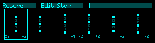

# Chordshift

A chord transform sequencer for the [Expert Sleepers disting NT](https://expert-sleepers.co.uk/distingNT.html).



Record chords from a MIDI keyboard or select from built-in templates, then play them back as a sequence with transposition, inversion, rotation, spread, strumming, and more.

## Installation

1. Download the latest `chordshift.o` from [Releases](../../releases)
2. Copy to an SD card or push via MIDI using [ntpush](https://github.com/expertsleepersltd/distingNT/blob/main/tools/push_plugin_to_device.py)
3. Load the plugin on your disting NT — it appears as **Chordshift** under Instrument/Utility

## Quick Start

1. **Patch** a gate to **In1** (Run) and a clock to **In2** (Clock)
2. **Connect** a MIDI keyboard (via USB, breakout, or internal bus)
3. **Set** your Root and Scale on the Scale page
4. **Record**: Set Record to On, play a chord on the keyboard — it captures when you release all keys, then auto-advances to the next step
5. Repeat for each step (up to 8)
6. **Record Off**, raise the Run gate, and send clock pulses to play back your sequence

The display shows a step grid (top) and a velocity/note visualization of the current playing chord (bottom). The edit step blinks when recording.

## Inputs

| Input           | Function                                                         |
| --------------- | ---------------------------------------------------------------- |
| **In1** — Run   | Rising edge starts transport; falling edge stops (all notes off) |
| **In2** — Clock | Rising edge advances to the next step                            |

## Parameter Pages

### Setup

| Parameter   | Range                                       | Default  | Description                         |
| ----------- | ------------------------------------------- | -------- | ----------------------------------- |
| Run         | CV input                                    |          | Gate input for transport start/stop |
| Clock       | CV input                                    |          | Trigger input for step advance      |
| MIDI In Ch  | All, 1–16                                   | 1        | MIDI input channel filter           |
| MIDI Out Ch | 1 – 16                                      | 2        | MIDI output channel                 |
| Destination | Breakout, SelectBus, USB, Internal, All     | Internal | MIDI output routing                 |
| Velocity    | 1 – 127                                     | 100      | Base velocity for output notes      |

### Scale

| Parameter | Range              | Default | Description                                                          |
| --------- | ------------------ | ------- | -------------------------------------------------------------------- |
| Root      | C – B              | C       | Scale root note                                                      |
| Scale     | Ionian – Min Penta | Ionian  | Scale type (7 modes + Harmonic Min, Melodic Min, Maj/Min Pentatonic) |
| Octave    | C1 – C7            | C3      | Base octave for output notes                                         |

### Record

| Parameter    | Range      | Default | Description                                                   |
| ------------ | ---------- | ------- | ------------------------------------------------------------- |
| Record       | Off, On   | Off     | Enable chord capture from MIDI input                          |
| Edit Step    | 1 – 8      | 1       | Which step to record into (auto-advances after capture)       |
| Capture Norm | Off, On   | Off     | Normalize captured chords so the lowest note becomes degree 0 |
| Clear Step   | No, Yes   | No      | Clear the current edit step                                   |
| Clear All    | No, Yes   | No      | Clear all steps                                               |
| Copy Step    | No, Yes   | No      | Copy current edit step to clipboard                           |
| Paste Step   | No, Yes   | No      | Paste clipboard to current edit step                          |
| Reset All    | No, Yes   | No      | Reset all step parameters to defaults                         |

### Playback

| Parameter | Range                            | Default | Description                                  |
| --------- | -------------------------------- | ------- | -------------------------------------------- |
| Play Mode | Forward, Reverse, Pendulum, Random | Forward | Step sequencer direction                     |
| Steps     | 1 – 8                           | 8       | Number of active steps                       |
| Clock Div | /1, /2, /3, /4, /6, /8, /12, /16 | /4     | Divide incoming clock before step advance    |

### Pitch

Global pitch transforms — these add to any per-step values.

| Parameter     | Range                         | Default | Description                                |
| ------------- | ----------------------------- | ------- | ------------------------------------------ |
| Transpose     | -14 – +14                     | 0       | Shift chord by scale degrees               |
| Reflect       | Off, Root, Lowest, Highest | Off     | Mirror notes around a reference point      |
| Spread        | -7 – +7                       | 0       | Expand or compress intervals between notes |
| Spread Anchor | Lowest, Center               | Lowest  | Reference point for spread                 |

### Voicing

| Parameter    | Range                     | Default | Description                                                                  |
| ------------ | ------------------------- | ------- | ---------------------------------------------------------------------------- |
| Inversion    | -4 – +4                  | 0       | Move bottom/top notes across octaves                                         |
| Rotation     | -7 – +7                  | 0       | Rotate the note order cyclically                                             |
| Normalize    | None, Lowest=0, First=0  | None    | Re-center the chord after transforms                                         |
| Density      | 0 – 100%                 | 100     | Probability each note in the chord sounds                                    |
| Oct Random   | -100 – +100%             | 0       | Random octave displacement per note (positive = up bias, negative = down)    |
| Oct Rnd Intv | 0 – 32                   | 0       | Minimum clock ticks between octave random re-rolls (0 = every step)          |
| Inv Random   | -100 – +100%             | 0       | Random inversion per playback (positive = up bias, negative = down)          |
| Inv Rnd Intv | 0 – 32                   | 0       | Minimum clock ticks between inversion random re-rolls (0 = every step)       |

### Articulate

| Parameter     | Range                                                                       | Default | Description                                          |
| ------------- | --------------------------------------------------------------------------- | ------- | ---------------------------------------------------- |
| Humanize      | 0 – 50 ms                                                                  | 0       | Random timing offset per note                        |
| Strum         | 0 – 100 ms                                                                 | 0       | Delay between successive notes in the chord          |
| Direction     | Up, Down, Pendulum, PingPong, Diverge, Converge, Random, Pedal Lo, Pedal Hi | Up      | Note playback order within the chord (affects strum) |
| Reverse       | No, Yes                                                                    | No      | Reverse the note order                               |
| Vel Shape     | Ramp, Curve, Peak, Step, Random                                            | Ramp    | Velocity distribution across strummed notes          |
| Vel Depth     | 0 – 100%                                                                   | 0       | Amount of velocity curve applied                     |
| Vel Deviation | 0 – 100%                                                                   | 5       | Random velocity variation per note                   |
| Time Shape    | Off, Ramp, Curve, Peak, Step, Random                                       | Off     | Strum timing distribution                            |
| Time Depth    | 0 – 100%                                                                   | 0       | Amount of time curve applied                         |

### Drift

Gradually evolving chord changes — the sequencer may swap notes for nearby scale tones on a clock-synced interval.

| Parameter      | Range                                    | Default | Description                                        |
| -------------- | ---------------------------------------- | ------- | -------------------------------------------------- |
| Drift          | 0 – 100%                                | 0       | Probability of substitution per eligible note      |
| Drift Interval | Off, 4, 8, 16, 32, 64, 128              | Off     | Clock ticks between drift re-rolls (Off = disabled)|
| Drift Style    | Neighbor, Functional, Orbit, Suspend, Wander, Plateau | Neighbor| Substitution strategy                    |
| Drift Scope    | Focused, Distributed, Unison, Anchor, Cascade, Spread | Focused | How drift targets steps across the sequence|

### Breath

Slow, wave-shaped movement of inner voices — notes shift up and down over time according to a selectable shape.

| Parameter    | Range                                                                                                                                     | Default    | Description                                  |
| ------------ | ----------------------------------------------------------------------------------------------------------------------------------------- | ---------- | -------------------------------------------- |
| Breath       | 0 – 2                                                                                                                                    | 0          | Maximum degree displacement per voice        |
| Breath Rate  | Off, 4, 8, 16, 32, 64, 128                                                                                                               | Off        | Clock ticks per full wave cycle (Off = disabled)|
| Breath Shape | Triangle, Square, Ramp, Random, Pendulum, Walk, Pulse, Sigh, Bloom, Alternate, Converge, Return, Sentence, Period, Arc, Suspend, Drift, Tide | Triangle | Wave shape for voice movement                |
| Breath Scope | All Inner, Rand Voice, Top Only, Contrary                                                                                                 | All Inner  | Which voices are affected                    |

### Randomize

Generate a random sequence with shape-controlled variation across steps.

| Parameter    | Range                                                    | Default | Description                                      |
| ------------ | -------------------------------------------------------- | ------- | ------------------------------------------------ |
| Randomize    | No, Yes                                                  | No      | Trigger randomization                            |
| Contour      | Random, Arc, Rise, Fall, Plateau, Sentence, Return, Flat, V-shape, Late Bloom, Period, Converge | Arc | Shape of transpose variation across steps (scaled to fit active step count) |
| Voice Lead   | Off, On                                                  | Off     | Optimize inversions for smooth voice leading     |
| Seq Length   | None, 8, 16, 32, 64, 128, 256                           | 32      | Target sequence length (None = lock steps, randomize Clock Div/Hold only) |
| Seq Div      | None, 1, 2, 4, 8, 16, 32                                | 4       | Clock division preset                            |
| Seq Hold     | Varied, Uniform                                          | Varied  | Hold step variation style                        |
| Template     | Off, 5th, Triad, 7th, 5th+Tri, 5th+7th, Tri+7th, All   | Tri+7th | Chord templates to pick from                     |
| Transpose    | 0 – 100%                                                 | 40      | Depth of transpose randomization per step        |
| Inversion    | 0 – 100%                                                 | 25      | Depth of inversion randomization per step        |
| Rotation     | 0 – 100%                                                 | 10      | Depth of rotation randomization per step         |
| Spread       | 0 – 100%                                                 | 10      | Depth of spread randomization per step           |
| Reverse      | 0 – 100%                                                 | 25      | Probability of reverse per step                  |
| Gate         | 0 – 100%                                                 | 25      | Depth of gate length randomization per step      |
| Repeat       | 0 – 100%                                                 | 0       | Depth of repeat randomization per step           |

### Per-Step (Step 1–8)

Each step has its own set of transforms that combine with the global values.

| Parameter | Range                                                                       | Default | Combination                                          |
| --------- | --------------------------------------------------------------------------- | ------- | ---------------------------------------------------- |
| Template  | Custom, Note, Fifth, Triad, 7th, Sus2, Sus4, Shell, Quartal, Cluster       | Custom  | Uses template degrees instead of captured chord      |
| Enabled   | No, Yes                                                                     | Yes     | —                                                    |
| Transpose | -14 – +14                                                                   | 0       | Additive (global + step)                             |
| Inversion | -4 – +4                                                                     | 0       | Additive                                             |
| Rotation  | -7 – +7                                                                     | 0       | Additive                                             |
| Spread    | -7 – +7                                                                     | 0       | Additive                                             |
| Reverse   | No, Yes                                                                     | No      | XOR (global ^ step)                                  |
| Strum     | 0 – 100 ms                                                                  | 0       | Additive                                             |
| Velocity  | -64 – +64                                                                   | 0       | Offset from base velocity                            |
| Gate      | 10 – 200%                                                                   | 100     | Gate length as percentage of step duration            |
| Prob      | 0 – 100%                                                                    | 100     | Probability the step plays                           |
| Reflect   | Off, Root, Lowest, Highest                                                  | Off     | Overrides global if nonzero                          |
| Repeat    | 1 – 4                                                                       | 1       | Ratchet — repeat the chord N times per step          |
| Hold      | 1 – 8                                                                       | 1       | Hold step for N clock ticks, scaling gate duration    |
| Direction | Up, Down, Pendulum, PingPong, Diverge, Converge, Random, Pedal Lo, Pedal Hi | Up      | Overrides global direction if nonzero                |
| Oct Random | -100 – +100%                                                               | 0       | Random octave displacement per note (positive = up bias, negative = down bias) |
| Inv Random | -100 – +100%                                                               | 0       | Random inversion per playback (positive = up bias, negative = down bias) |
| Density    | 0 – 100%                                                                    | 100     | Probability each note in the chord sounds            |

## How Capture Works

With Record on, hold the notes you want and release — the chord is saved to the current edit step, which then auto-advances. Notes always pass through to the output.

## Transform Pipeline

Each clock tick copies the base chord and runs it through:

```
Base Chord → Drift → Pitch → Voicing → Normalize → Order → Breath → Render → MIDI Out
```

| Stage     | Detail                          |
|-----------|---------------------------------|
| Drift     | Random note substitution        |
| Pitch     | Transpose → Reflect → Spread    |
| Voicing   | Inversion → Rotation            |
| Normalize | None / LowestTo0 / FirstTo0     |
| Order     | Reverse → Direction             |
| Breath    | Slow inner-voice movement       |

## Building from Source

Requires `arm-none-eabi-g++` (ARM GCC toolchain).

```bash
git clone --recurse-submodules <repo-url>
cd midi-chords
make            # Build chordshift.o
make push       # Build and push to disting NT via ntpush
```
